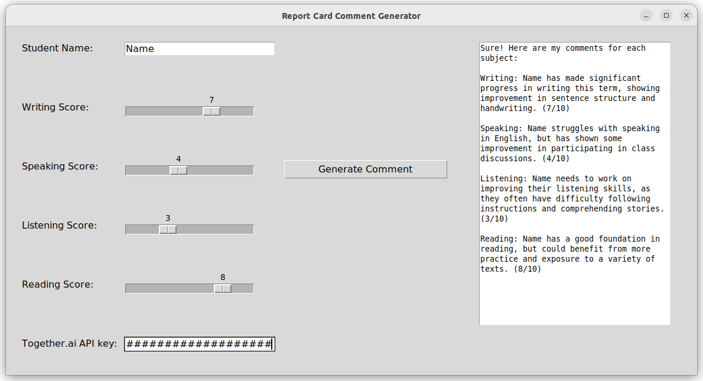

# comment_generator
Comment Generator for First Grade ESL Student Report Cards

This comment generator is designed to assist teachers in generating comments
for first grade ESL student report cards. It leverages the power of a 
Large Language Model (Llama-2) in combination with basic Retrieval-Augmented 
Generation, using API calls to Together.ai.

Getting Started

To use the comment generator, follow these steps:

-Obtain an API key from Together.ai. Sign up on their platform to receive enough free credits.

-On the comment generator interface, locate the input field and paste your API key.

-Enter the student's name and adjust the scores on the provided sliders.

-Click the "Generate Comment" button.

The generator will utilize the API to produce comments based on the provided information. 
The generated comments will be displayed in the output box, and can be copied and pasted.

